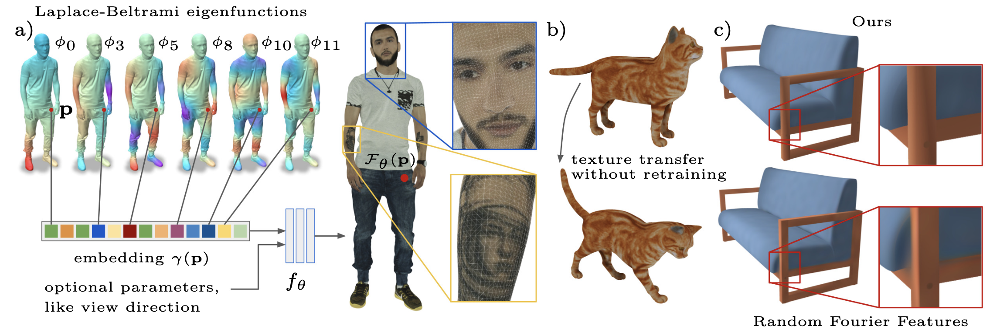

<h2 align="center">Intrinsic Neural Fields: Learning Functions on Manifolds</h2>

<p align="center">
    <a href="https://lukaskoestler.com">Lukas Koestler</a><sup>1*</sup> &emsp;
    <a href="https://www.linkedin.com/in/daniel-m-grittner/">Daniel Grittner</a><sup>1*</sup> &emsp;
    <a href="https://www.vsa.informatik.uni-siegen.de/en/moeller-michael">Michael Moeller</a><sup>2</sup> &emsp;
    <a href="https://vision.in.tum.de/members/cremers">Daniel Cremers</a><sup>1</sup> &emsp;
    <a href="https://zorah.github.io">Zorah Lähner</a><sup>2</sup> &emsp;
</p>

<p align="center">
    <sup>*</sup>equal contribution&emsp;&emsp;&emsp;
</p>

<p align="center">
    <sup>1</sup>Technical University of Munich&emsp;&emsp;
    <sup>2</sup>University of Siegen<br>
</p>

<p align="center">
    European Conference on Computer Vision (ECCV) 2022, Tel Aviv, Israel
</p>

<p align="center">
<a href="https://arxiv.org/abs/2203.07967">arXiv</a> |
<a href="https://youtu.be/EWLbORx8C4U">Video</a> |
<a href="https://lukaskoestler.com/static/0927_md5=bcec45fabae80b15c8ab7f45cb3c31e6.pdf">Poster</a>
</p>

<p>&nbsp;</p>


<p align="justify"><sub>(a) Overview of our method. We use the eigenfunctions of the Laplace-Beltrami operator (LBO) at each point as a point embedding. This overcomes the spectral bias of the multilayer perceptron (MLP), and hence the combined intrinsic neural field can represent a high-frequency function on the surface. Notice that the point can be inside a triangle, and the function is clearly more detailed than the discretization (insets). (b) An intrinsic neural texture field trained on one shape (top) can be transferred to a new shape (bottom) without retraining. (c) Due to our intrinsic approach (LBO eigenfunctions) local geometry is maintained in close but separate parts, whereas an extrinsic approach (Random Fourier Features) shows bleeding artifacts when trained with sparse supervision.</sub></p>

<p>&nbsp;</p>

## Abstract

<p align="justify">Neural fields have gained significant attention in the computer vision community due to their excellent performance in novel view synthesis, geometry reconstruction, and generative modeling. Some of their advantages are a sound theoretic foundation and an easy implementation in current deep learning frameworks. While neural fields have been applied to signals on manifolds, e.g., for texture reconstruction, their representation has been limited to extrinsically embedding the shape into Euclidean space. The extrinsic embedding ignores known intrinsic manifold properties and is inflexible wrt. transfer of the learned function. To overcome these limitations, this work introduces intrinsic neural fields, a novel and versatile representation for neural fields on manifolds. Intrinsic neural fields combine the advantages of neural fields with the spectral properties of the Laplace-Beltrami operator. We show theoretically that intrinsic neural fields inherit many desirable properties of the extrinsic neural field framework but exhibit additional intrinsic qualities, like isometry invariance. In experiments, we show intrinsic neural fields can reconstruct high-fidelity textures from images with state-of-the-art quality and are robust to the discretization of the underlying manifold. We demonstrate the versatility of intrinsic neural fields by tackling various applications: texture transfer between deformed shapes & different shapes, texture reconstruction from real-world images with view dependence, and discretization-agnostic learning on meshes and point clouds.</p>


## Code and Data Release

- [X] 📣 Release main code and data
- [X] Release local triangulation code as a Python package for ray-pointcloud intersection. Has been merged into [nmwsharp/potpourri3d](https://github.com/nmwsharp/potpourri3d/commit/adb76f1566bba2ef2bc2d1a6e6c57346796c89f8).
- [X] Publish BigBIRD configs, data, and scripts. Pushed into banch [bigbird](https://github.com/tum-vision/intrinsic-neural-fields/tree/bigbird) and will be merged into master after aditional checks.

## Data

The data for the experiments can be downloaded by running the following command:

```
./download_data.sh
```

## Installation

Run the following for creating a conda environment and installing the required dependencies:

```
conda create --name intrinsic-neural-fields python=3.6 -y
conda activate intrinsic-neural-fields

# Dependencies
pip3 install --ignore-installed certifi "trimesh[all]"
conda install pytorch torchvision cudatoolkit=11.3 -c pytorch -y
pip3 install numpy==1.18.0
conda install -c conda-forge igl pyembree tqdm torchinfo==1.5.4 imageio tensorboardx opencv pyyaml -y
conda install scikit-image matplotlib -y
pip3 install lpips crc32c robust_laplacian
```

## Data Preprocessing 

1) Preprocess eigenfunctions:

```
python preprocess_eigenfunctions.py ...  # See preprocess_eigenfunctions.py for the arguments
```

2) Preprocess the training splits (train, val, test):

```
python preprocess_dataset.py ...  # See preprocess_dataset.py for the arguments
```

**Recommended:** For convenience, you can also use the prepared preprocessing scripts: 

```
./preprocessing_scripts/<SCRIPT_NAME>
```

## Training

After the preprocessing, run the following for trainings

```
python train.py <path-to-your-config> --allow_checkpoint_loading
```

After the training, you can run

```
python eval.py ...  # See eval.py for the arguments
```

**Recommended:** For convenience, you can also use the prepared training scripts: 

```
./training_scripts/<SCRIPT_NAME>
```
Please note that most scripts require the method as an input parameter. Please review the scripts for possible input parameters.

## Visualizations

1) Rendering a view from a given camera position

```
python render_view.py ...  # See render_view.py for the arguments
```

2) Bake the learned texture into a UV-map for exploration

```
python bake_texture_field.py ...  # See bake_texture_field.py for the arguments
```

## Expected Dataset structure for preprocessing

Custom datasets can be used with the existing code if they have the following folder structure:

    dataset
        |_ train.lst (Defines which views are preprocessed for training)
        |_ test.lst (Defines which views are preprocessed for testing)
        |_ val.lst (Defines which views are preprocessed for validation)
        |_ <view-name> (Represents a view)
            |_ depth
                |_ cameras.npz (camera parameters)
                |_ depth_0000.exr (depth map)
            |_ image
                |_ 000.png (GT view)
            |_ ... (the rest does not matter)
        |_ ...

## License

The code is provided under a BSD 3-clause license. See the LICENSE file for details. Note also the different licenses for thirdparty submodules.
